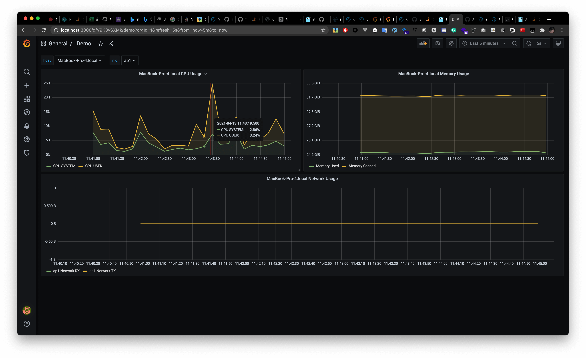

# A simple metric collector write by go

the mini-project implement metrics collect (cpu, memory, net) that can parse metrics and send to influxdb and visualization at grafana.

## Demo



## Test

```
go test -v ./pkg/collector
```

## Build

```
go build -o client cmd/agent/main.go
```

## Usage
```
  -endpoint string
        influx api endpoint url (default "http://localhost:8086")
  -interval int
        collect metric interval (default 10)
  -token string
        influx api token (default "token")
```

## Design

```
BaseCollector ->
					CpuCollector
				    MemoryCollector	
					NetCollector

BaseEndpoint
			 -> 	
					InfluxEndpoint
```

